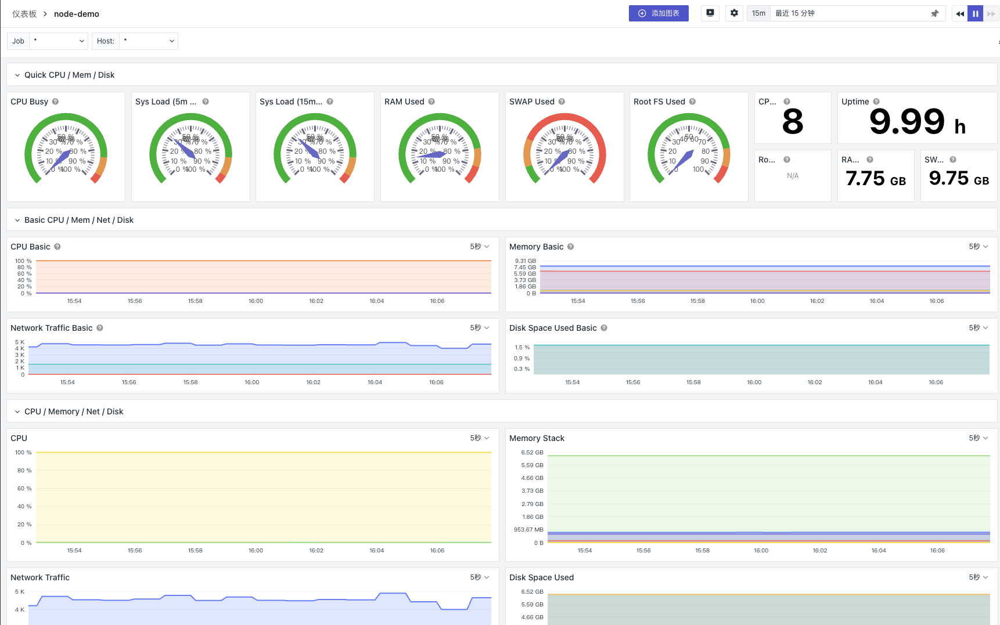

## Introduction

Taking Ubuntu as an example, this guide demonstrates how to use the command line interface to import the Grafana dashboard [Node Exporter Full](https://grafana.com/grafana/dashboards/1860-node-exporter-full/) using Guance CLI.

