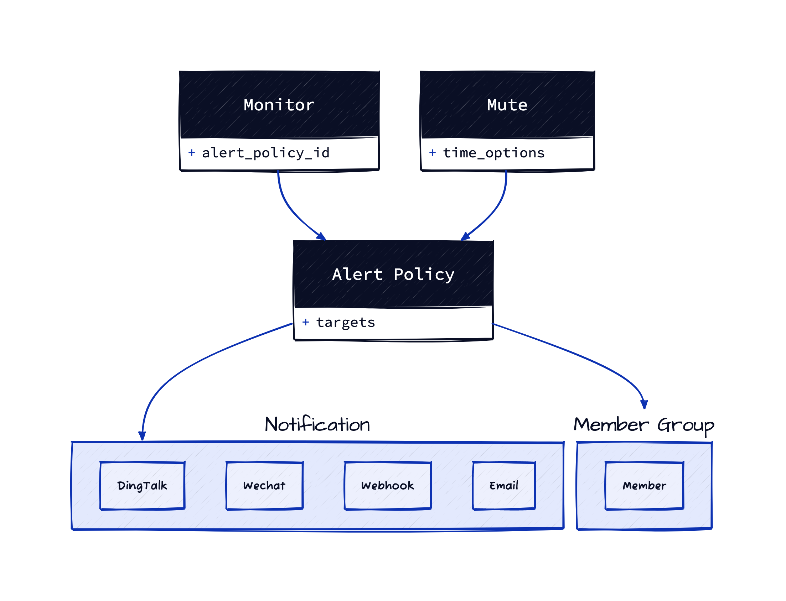

Terraform Introuction
=====================

Use Terraform create an observability stack

Introduction
------------

Terraform is an open-source infrastructure as code software tool created by HashiCorp. It enables users to define and provision an infrastructure using a high-level configuration language known as HashiCorp Configuration Language (HCL), or optionally JSON.

### The entities



In this lab, we will implement a typical monitoring and alerting scenario together. Configure a monitor and an alert policy to notify a member group or notification object, such as an IM group, whenever a condition is triggered. At the same time, configure an additional silent rule to silence the alert message when the monthly scheduled downtime arrives for system maintenance.

### External Resources

You can see the follow resources for details:

1.	[Terraform Website](https://www.terraform.io/)
2.	[Terraform Guance Cloud Provider](https://registry.terraform.io/providers/GuanceCloud/guance)

Step 0: Prepare the environment
-------------------------------

### Lab environment

In this course we will use the [Terraform](https://www.terraform.io/) to create the observability stack. All of the related tools is installed in the lab environment. You can open the integrated-terminal of IDE on the right side.

### Login Guance

The first, you should login Guance with your account.

1.	Open the [Guance Console](https://console.guance.io/) in your browser.
2.	Login with your account.
3.	Open the [API Key Management](https://console.guance.com/workspace/apiManage) page, create a new key, and copy the `Key ID` content.
4.	Open the integrated-terminal of IDE on the right side, and run the following command to login Guance:

	```shell
	export GUANCE_ACCESS_TOKEN=<your key id>
	```

### Understand the lab environment

In the right side, you can see the lab environment. It contains the following files and directories:

```shell
src/ # The directory contains all the terraform files.
```

Step 1: Configure Monitor
-------------------------

**Note**: All the code is in `~/lab/src/monitor.tf`, you can open it on the right side.

Monitor is the core of Guance. It is a JSON file that describes the metrics to be collected and the alert policies to be applied.

### Create a monitor

See an example file named `monitor.json` with the following content:

```shell
cat ~/lab/src/monitor.json
```

Then create a terraform file to define the monitor:

```terraform
resource "guance_monitor" "demo" {
  manifest     = file("${path.module}/monitor.json")
  alert_policy = {
    id = guance_alertpolicy.demo.id
  }
}
```

Step 2: Configure Alert Policy
------------------------------

**Note**: All the code is in `~/lab/src/alertpolicy.tf`, you can open it on the right side.

### Create member group by email

In this example, the alert policy will send alerts to a member group. So we need to get the member id by email. And create a new member group from them.

```terraform
data "guance_members" "demo" {
  filters = [
    {
      name   = "email"
      values = [var.email] # you can also add more emails here
    }
  ]
}

resource "guance_membergroup" "demo" {
  name       = var.name
  member_ids = data.guance_members.demo.items[*].id
}
```

### Create alert policy

The alert policy will send alerts to the member group we created above.

```terraform
resource "guance_alertpolicy" "demo" {
  name           = var.name
  silent_timeout = "1h"

  statuses = [
    "critical",
    "error",
    "warning",
    "info",
    "ok",
    "nodata",
    "nodata_ok",
    "nodata_as_ok",
  ]

  alert_targets = [
    {
      type = "member_group"
      member_group = {
        id = guance_membergroup.demo.id
      }
    }
  ]
}
```

Step 3: Configure Mute Rule
---------------------------

**Note**: All the code is in `~/lab/src/mute.tf`, you can open it on the right side.

### Create mute rule

The mute rule will mute the alert policy we created above.

In this example, we will mute the alert policy we created above when the planned down-time is coming (e.g. 05:00:00 - 10:00:00 every day). If the alert policy is triggered during the planned down-time, it will be muted for 30 seconds. This mute rule will also send a message to the member group before 15 minutes.

```terraform
resource "guance_mute" "demo" {
  // mute ranges
  mute_ranges = [
    {
      type = "alert_policy"

      alert_policy = {
        id = guance_alertpolicy.demo.id
      }
    }
  ]

  // notify options
  notify = {
    message = <<EOF
      Muted
    EOF

    before_time = "15m"
  }

  notify_targets = [
    {
      type = "member_group"

      member_group = {
        id = guance_membergroup.demo.id
      }
    }
  ]

  // cron options
  repeat = {
    crontab_duration = "30s"
    start            = "05:00:00"
    end              = "10:00:00"
    expire           = "2023-12-31T12:00:00Z"
    crontab          = {
      min   = "0"
      hour  = "0"
      day   = "*"
      month = "*"
      week  = "*"
    }
  }

  mute_tags = [
    {
      key   = "host"
      value = "*"
    }
  ]
}
```

Step 4: Apply Resources
-----------------------

Now that we have a configuration, we can apply it. Terraform will look at the configuration and figure out what changes need to be made to move from the current state to the desired state, and then make those changes. In our case, we create the observability stack in once apply.

```shell
terraform apply
```

Then you can see the execution plan such as:

```shell

```

Step 5: Check Results
---------------------

Open the Guance console, you can see the observability stack is created.

-	[Monitor](https://console.guance.com/monitor/checkerrulelist)
-	[Mute Rule](https://console.guance.com/monitor/silence/list)
-	[Alert Policy](https://console.guance.com/monitor/checkerrulegrouplist)
-	[Member Group](https://console.guance.com/workspace/members): Click the member group button.

All of them is configured by Terraform.

Step 6: Clean Up
----------------

```bash
terraform destroy
```

Then you can see the execution plan such as:

```bash

```

Press `yes` to destroy the infrastructure.
